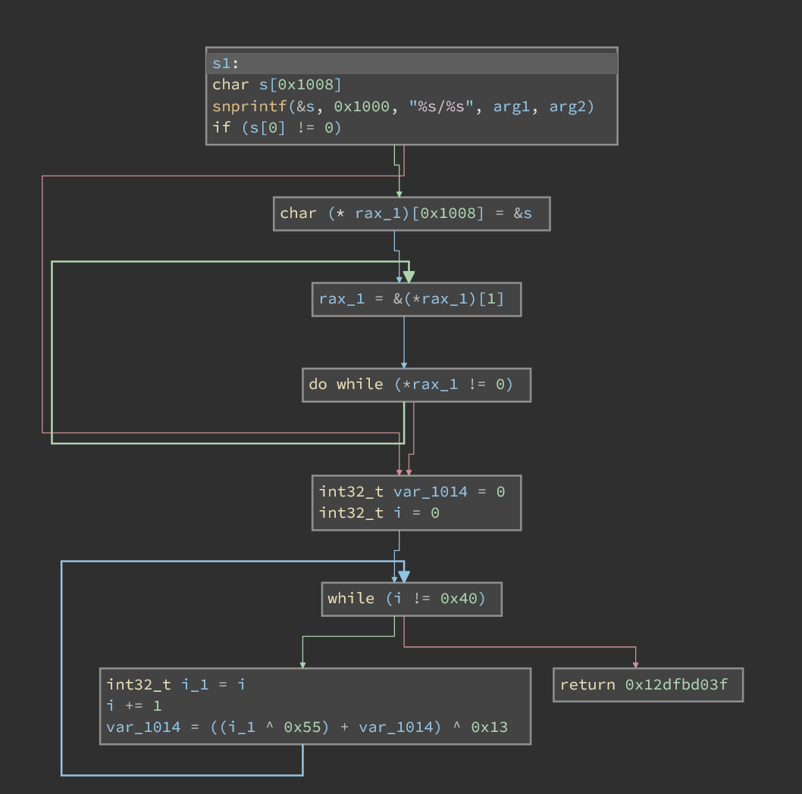
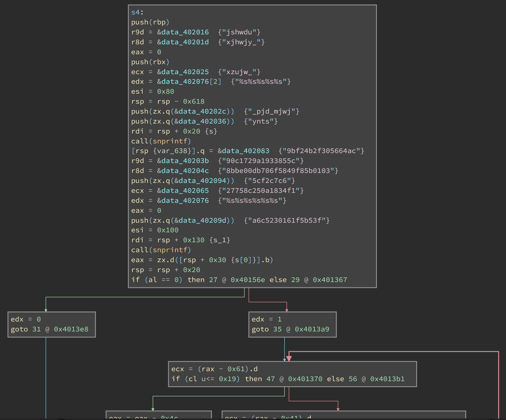

# Reverse 4

## Description

Recover the hidden flag from the provided Linux binary.

## Files

* [reverse4](<files/reverse4>)

---

Here is a complete, start-to-finish writeup for solving this reverse engineering challenge. You can use this as a template for a CTF writeup or documentation.

---

## Initial Triage & Static Analysis
Upon initial inspection of the provided Linux ELF binary (`reverse4`), looking at the symbols and strings reveals heavy usage of the OpenSSL library. Specifically, the presence of the following functions immediately gives away the core mechanism of the challenge:
* `EVP_DecryptInit_ex`
* `EVP_DecryptUpdate`
* `EVP_DecryptFinal_ex`
* `EVP_aes_256_cbc`

This tells us the binary is performing **AES-256-CBC decryption**. We also notice several hardcoded strings, including hexadecimal chunks (`90c17...`, `8bbe0...`) and seemingly gibberish strings (`jshwdu`, `xjhwjy_`).

## Analyzing the Execution Flow



Opening the binary in a decompiler (Binary Ninja) and examining the `main` function reveals a directory traversal loop. 

The program opens `/etc` and iterates through every file, passing the filenames into a function called `s1()`. After processing the entire directory, it calls a final function, `s4()`, and exits. 
* **The Trap:** While `s1()` processes local system files, dynamic analysis or patching the binary to bypass the `/etc` check isn't strictly necessary. The actual cryptographic payload and decryption routine are completely contained within `s4()`. We can bypass execution entirely and solve this statically.

## Deep Dive into `s4()`: Extracting the Parameters



Inside `s4()`, the binary prepares the arguments for the AES decryption. It uses `snprintf` to concatenate string fragments stored in registers (`RCX`, `R8`, `R9`) and the stack.

### Recovering the AES Key
The program pushes five string fragments and concatenates them using the format `"%s%s%s%s%s"`:
1.  `"xzujw_"`
2.  `"xjhwjy_"`
3.  `"jshwdu"`
4.  `"ynts"`
5.  `"_pjd_mjwj"`

Concatenated: `xzujw_xjhwjy_jshwduynts_pjd_mjwj`
Immediately after, the binary loops over this string and applies a Caesar cipher shift of **-5**. 
* **Decoded Key:** `super_secret_encryption_key_here` (Exactly 32 bytes, perfect for AES-256).

### Recovering the Ciphertext
The binary repeats this concatenation technique for the ciphertext using the format `"%s%s%s%s%s%s"`. By tracking the stack pointers, we find the true order of the hex fragments:
1.  `27758c250a1834f1`
2.  `8bbe00db706f5849f85b0103`
3.  `90c1729a1933855c`
4.  `a6c5230161f5b53f`
5.  `5cf2c7c6`
6.  `9bf24b2f305664ac`

Concatenating these yields a 96-character hex string (48 bytes / 3 AES blocks):
* **Ciphertext:** `27758c250a1834f18bbe00db706f5849f85b010390c1729a1933855ca6c5230161f5b53f5cf2c7c69bf24b2f305664ac`

## The IV Trap (The Twist)
Initially, it appeared the Initialization Vector (IV) was pointing to a null-initialized `.bss` segment, suggesting an IV of `\x00 * 16`. 

Writing a standard decryption script with a null IV yields the following output:
`b'S`tlW`e|Khoxm\x7fQKid_Not_Protect_Me}\x0e\x0e\x0e\x0e\x0e\x0e\x0e\x0e\x0e\x0e\x0e\x0e\x0e\x0e'`

Because AES-CBC mode is self-recovering, an incorrect IV only scrambles the *first block* (16 bytes) of the plaintext. The rest of the flag (`id_Not_Protect_Me}`) decrypted perfectly alongside standard PKCS#7 padding.

By examining the scrambled first block (`S`tlW`e|Khoxm\x7fQKi`) and XORing it against the expected plaintext format (`SavoSec{...`), a pattern emerges:
* `S` (0x53) ^ `0x00` = **S** (0x53)
* ``` ` ``` (0x60) ^ `0x01` = **a** (0x61)
* `t` (0x74) ^ `0x02` = **v** (0x76)
...and so on.

The true IV was simply a sequential byte array: `0x00, 0x01, 0x02 ... 0x0F`.

## The Solution Script
With the key, ciphertext, and correct IV fully recovered, we can write a Python script using `pycryptodome` to decrypt the flag offline.

```python
from Crypto.Cipher import AES
from Crypto.Util.Padding import unpad
import binascii

# 1. Setup the extracted parameters
key = b"super_secret_encryption_key_here"
iv = bytes(range(16)) # Sequential IV: 0x00 to 0x0F
ct_hex = "27758c250a1834f18bbe00db706f5849f85b010390c1729a1933855ca6c5230161f5b53f5cf2c7c69bf24b2f305664ac"

# 2. Convert hex ciphertext to raw bytes
ciphertext = binascii.unhexlify(ct_hex)

# 3. Decrypt
cipher = AES.new(key, AES.MODE_CBC, iv)
padded_plaintext = cipher.decrypt(ciphertext)

# 4. Remove padding and decode
flag = unpad(padded_plaintext, AES.block_size).decode('utf-8')

print(f"Flag: {flag}")
```

### Final Flag

**`SavoSec{Caesar_Did_Not_Protect_Me}`**
