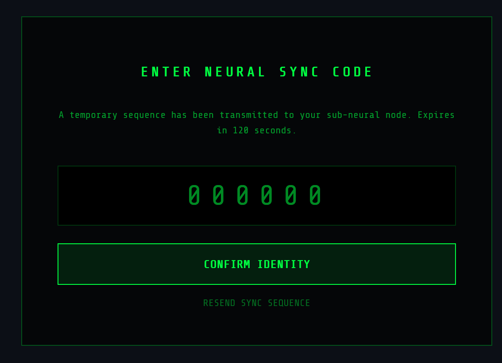
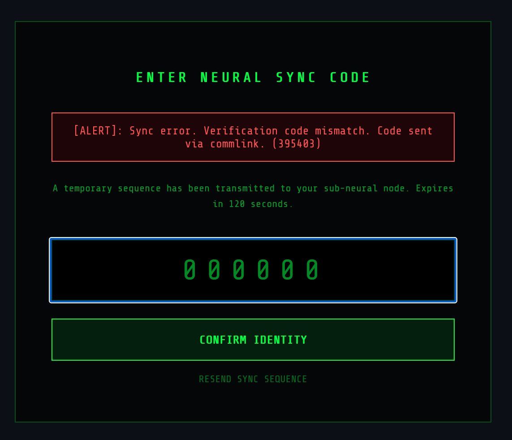

git-dumper http://website.com/.git ~/website# One does not simply walk into...

## Description

NeuroSync Corp is the leading provider of neural-link technology. Their administrative portal is rumored to be impenetrable, protected by a sophisticated **two-factor authentication** system.

Reports suggest that a recent update to their synchronization protocol was implemented by their new AI Agent model. Can you figure out how to breach it?

---

host: https://ctf1.savosec.fi/portal/

html source code reveals credentials:

``<!-- Internal Log: Default credential sequence: sysadmin:neuro_sync_master_2055 | Remove it before deployment -->``

aw snap, 2fa, lets try 000000

the page tells us the 2fa code: ``395403``

SavoSec{N3v3r_TrU5t_Th3_V1b3C0d3_2FA} 
