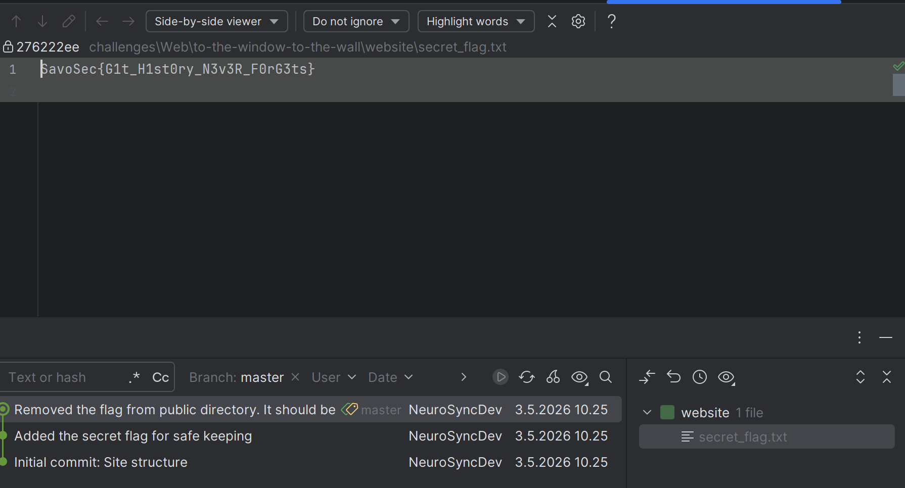

# To the window... to the wall...

## Description

The "Legacy Node" is currently down for maintenance. The developers say they are rolling back to a previous version because of a "configuration error". The Node has been under constant attack because it's known for the contents hidden in its directories.

Even though the Node is down, it seems they might have left the **version control** system exposed to the public.

---

host: https://ctf1.savosec.fi/open_window/
Dump the .git directory of the website and use the commit history to find the flag.

git-dumper https://ctf1.savosec.fi/open_window/.git ./website

SavoSec{G1t_H1st0ry_N3v3R_F0rG3ts}